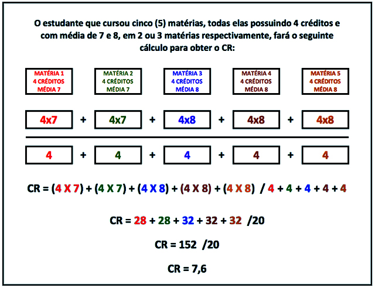

# calculadoraCRUerj

Projeto de calculadora de Coeficiente de Rendimento (CR) da UERJ, a fim de facilitar a vida do estudante universitário e concientizar o mesmo sobre como é feito o cálculo do seu CR.

Oferece duas opções de uso:
- Console (Main)
- Interface Gráfica (WMain)

## CR
