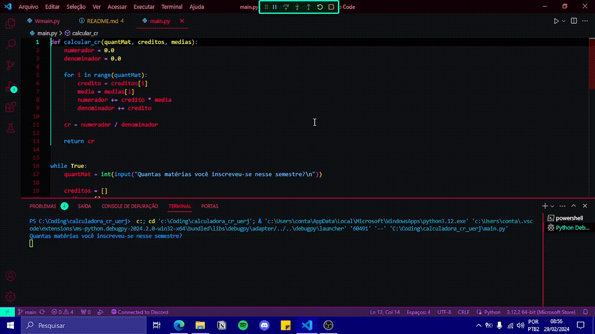

# Calculadora de Coeficiente de Rendimento da UERJ (calculadoraCRUerj)

Este é um projeto de calculadora de Coeficiente de Rendimento (CR) da UERJ, desenvolvido para facilitar a vida do estudante universitário e conscientizá-lo sobre como é feito o cálculo do seu CR.

Oferece duas opções de uso:

- **Console (Main)**  
  

- **Interface Gráfica (WMain)**  
  

## CR

## Como Usar

Para utilizar esta calculadora, siga estas etapas:

1. Clone o repositório para sua máquina local.
2. Abra o arquivo principal do projeto no seu ambiente de desenvolvimento preferido.
3. Siga as instruções específicas para cada opção de uso (console ou interface gráfica) conforme documentado no código ou na seção correspondente deste README.

---

**Nota:** Certifique-se de ter as dependências necessárias instaladas antes de executar o projeto.

